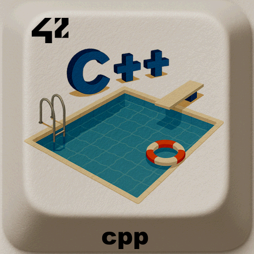

<div align="center">
  <h1>CPP Modules – C++ Learning Path</h1>
  
  <br>
</div>


> The **CPP modules** are a set of 10 projects (00 → 09) introducing **C++98** and its Object-Oriented Programming concepts.

---

## 📖 Table of Contents
- [Description](#-description)
- [Installation](#%EF%B8%8F-installation)
- [Usage](#-usage)
- [Project Structure](#-project-structure)
- [Examples](#-examples)
- [Roadmap](#-roadmap)
- [Credits](#-credits)
- [License](#-license)

---

## 📝 Description
Each module introduces new concepts:  
- **00**: Basics, namespaces, classes, member functions.  
- **01**: Memory allocation, references, pointers.  
- **02**: Ad-hoc polymorphism, operator overloading.  
- **03**: Inheritance.  
- **04**: Subtype polymorphism, abstract classes, interfaces.  
- **05**: Exceptions.  
- **06**: Casts.  
- **07**: Templates.  
- **08**: Templated containers, iterators, algorithms.  
- **09**: STL, advanced exercises.  

---

## ⚙️ Installation
Requirements:  
- OS: Linux or macOS  
- C compiler (gcc, clang)  
- `make`

```bash
git clone https://github.com/LogUmi/cpp.git
cd cpp/XX/exXX
make
```
This will generate one executable named as required in the current directory.

---

## 📂 Project Structure

```
.
├── img/				# Content for README
├── 00/					# Content of module 00
│	├── ex00/
│	│	├── src/        # Header files (.hpp) and source code (.cpp)
│	│	├── Makefile
│	├── ex01/
│	│	├── src/        # Header files (.hpp) and source code (.cpp)
│	│	├── Makefile
│	├── ex02/
│	│	├── src/        # Header files (.hpp) and source code (.cpp)
│	│	├── Makefile
│	├── fr.subject.pdf	# Module subject 
├── 01/					# Content of module 01
├── 02/					# Content of module 02
├── 03/					# Content of module 03
├── 04/					# Content of module 04
├── 05/					# Content of module 05
├── 06/					# Content of module 06
├── 07/					# Content of module 07
├── 08/					# Content of module 08
├── 09/					# Content of module 09
├── LICENSE			    # License MIT
└── README.md
```
> Each module directory contains one sub-directory per exercise (variable between 3 and 7) with the same structure as module 00 deployed above.

---

## 🔎 Examples

```bash
$ cd cpp/00/ex01
$ make
compilation completed, exec phonebook ready.
$ ./phonebook
Welcome in My Awesome PhoneBook !
[INPUT] Please type a command ADD, SEARCH or EXIT:

```

---

## 🚀 Roadmap
By now only modules 00 to 04 are completed. Modules 05 to 09 are coming soon.

This project is the original version that was evaluated at 42 and will remain in this state once completed.

---

## 👤 Credits
Project developed by **Loïc Gérard** – 📧 Contact: lgerard@studend.42perpignan.fr - [École 42 Perpignan](https://42perpignan.fr).

---

## 📜 License
This project is licensed under the MIT License. You are free to use, modify, and distribute it - see the [LICENSE](./LICENSE) file for details.

> ⚠️ **Note for students**  
> If you are a student at 42 (or elsewhere), it is strongly recommended **not to copy/paste** this code.  
> Instead, try to **write your own solution** — it’s the only way to really learn and succeed.